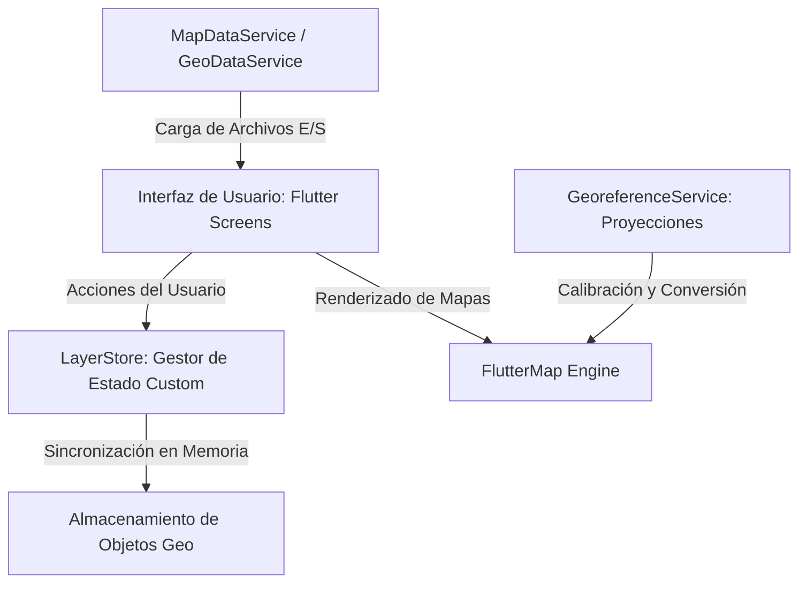

# NAVIMAP 🛰️📐
### Sistema de Información Geográfica (GIS) Avanzado y Multiplataforma en Flutter

**NAVIMAP** es una solución cartográfica y GIS (Sistema de Información Geográfica) de alto rendimiento desarrollada en Flutter. Está diseñada para la visualización interactiva, calibración de precisión y gestión táctica de datos geográficos sobre capas satelitales y planos en formato GeoPDF. La aplicación implementa una arquitectura desacoplada y un motor de sincronización de estado reactivo y bidireccional especialmente optimizado para operar sin latencia en entornos de campo e industriales.

---

## 🏗️ Arquitectura del Sistema y Diseño Técnico

El proyecto sigue principios de diseño de software empresarial, garantizando mantenibilidad, separación de responsabilidades y alto rendimiento en plataformas **Web** y **Escritorio (Windows)**.



### 1. Motor de Sincronización Reactiva y Respaldo ("Shadow Sync")
En el núcleo de la aplicación se encuentra `LayerStore`, un motor de estado personalizado desarrollado en Dart que gestiona la consistencia de datos geográficos (puntos, líneas y polígonos) entre múltiples contextos:
* **Sincronización Bidireccional Cruzada**: Al añadir, renombrar o editar un elemento en un mapa específico, el cambio se propaga reactivamente hacia el respaldo global en memoria y hacia otros mapas vinculados que compartan dicha capa.
* **Controlador de Bucles de Redundancia**: Implementa banderas de seguridad (`isSyncCall`) que detienen la propagación en cascada de actualizaciones, previniendo referencias circulares y loops de re-renderizado.
* **Normalización Case-Insensitive**: Resolución automática mediante nombres canónicos para las claves de las capas, eliminando conflictos causados por mayúsculas, minúsculas o espacios adicionales en el ingreso del usuario.
* **Borrado Propagado con Aislamiento**: Ofrece una experiencia flexible de eliminación. El usuario puede decidir si borrar un objeto localmente en un mapa o realizar una purga global que actualice todos los contextos activos en tiempo real.

### 2. Estrategia de E/S Multiplataforma Híbrida (Web & Windows Desktop)
La aplicación aborda de forma eficiente las diferencias del ciclo de vida de archivos entre plataformas:
* **Plataforma Web (Edge/Chrome)**: Consume transmisiones de bytes en memoria directa (`Uint8List`) a través de la API del navegador para agilizar la carga en memoria RAM.
* **Plataforma Escritorio (Windows)**: En lugar de cargar archivos masivos directamente en memoria (lo que causaría picos de consumo de RAM), el selector de archivos interactúa directamente con la ruta local física (`path`), realizando lecturas asíncronas por flujo utilizando flujos de lectura optimizados de `dart:io`.

### 3. Procesamiento de Metadatos GeoPDF y Transformación de Coordenadas
NAVIMAP incorpora un motor matemático capaz de analizar metadatos geoespaciales ocultos dentro de la estructura binaria de archivos PDF:
* **Algoritmo de Extracción y Descompresión**: Escanea y descomprime flujos comprimidos mediante `FlateDecode` usando el códec `zlib` para localizar diccionarios CTM (Current Transformation Matrix), TiePoints y WKT (Well-Known Text).
* **Georreferenciación Precisa**: Implementa proyecciones cartográficas avanzadas a través de `proj4dart`, soportando sistemas de coordenadas proyectadas como **Origen Nacional (EPSG:9377)**, **Magna-Sirgas / Origen Bogotá (EPSG:3116)**, **UTM (Universal Transverse Mercator)** y **WGS84 (EPSG:4326)**.
* **Cálculo de Distancias y Áreas**: Módulos dedicados para el cálculo de longitud geodésica y áreas de polígonos complejos directamente en el mapa.

---

## 🎨 Características Destacadas y UX/UI

* **Visualización de Precisión Quirúrgica**: Retícula estática central (mira combinada) para capturar coordenadas exactas basadas en la posición central de la cámara del mapa.
* **Gestión Avanzada de Capa Activa**:
  * Visualización intuitiva: la capa seleccionada se resalta con indicadores tácticos y se reordena al inicio de la lista para priorizar el flujo de trabajo del operador.
  * Auto-activación inteligente: si no hay ninguna capa activa en el mapa, al crear cualquier punto, línea o polígono, la aplicación genera dinámicamente una nueva capa estructurada (ej. "Capa 1"), la activa y vincula automáticamente el objeto a esta.
* **Personalización de Atributos de Objetos**:
  * Modificación en caliente de nombres y coordenadas.
  * Selector rápido de 6 colores tácticos estándar que actualizan tanto el marcador en pantalla como su icono representativo en listados y exportaciones.
  * Registro de marcas de tiempo (`createdAt`) inmutables que solo se actualizan al alterar las coordenadas espaciales del elemento.

---

## 🛠️ Stack Tecnológico

* **Lenguaje**: Dart 3.x
* **Framework**: Flutter 3.x (Soporte nativo para Web y Windows Desktop)
* **Cartografía**: `flutter_map` para el renderizado interactivo de capas de teselas y geometrías vectoriales.
* **Renderizado PDF**: `pdfx` para rasterización de alta fidelidad y procesamiento nativo de páginas PDF.
* **Sistemas de Proyección**: `proj4dart` para conversión matemática y proyección de puntos GPS sobre planos cartográficos.
* **Estilo**: Sistema de Diseño personalizado (`DesignSystem`) basado en una paleta de colores oscuros de alto contraste optimizada para su legibilidad bajo luz solar directa o en campo.

---

## 📦 Estructura del Código Fuente

El código se divide bajo una estructura modular limpia y legible:

* **`/lib/services/`**: Módulos de lógica empresarial y procesamiento de datos.
  * `layer_store.dart`: Corazón de almacenamiento, lógica de sincronización y validación de duplicados.
  * `georeference_service.dart`: Motor de lectura binaria de GeoPDF, proyecciones geográficas y utilidades de conversión de coordenadas (DMS, DM, UTM, Origen Nacional).
  * `map_data_service.dart`: Sistema de caché en memoria de mapas renderizados para acelerar las cargas subsiguientes del mismo archivo.
* **`/lib/screens/`**: Componentes visuales y páginas de la aplicación.
  * `map_detail_screen.dart`: Pantalla cartográfica interactiva para mapas PDF con herramientas de trazado y retícula.
  * `satellite_view_screen.dart`: Vista de satélite híbrida con soporte de GPS y colocación de marcadores en tiempo real.
  * `map_layer_library_screen.dart`: Gestor y biblioteca de capas del mapa con opciones de exportación y eliminación con confirmación de estado.
* **`/lib/widgets/`**: Componentes y diálogos reutilizables de UI (tarjetas, botones tácticos, diálogos de confirmación, etc.).

---

## ⚙️ Configuración y Ejecución del Proyecto

1. **Requisitos previos**:
   * Tener instalado el SDK de Flutter (versión 3.22 o superior recomendada).
   * Habilitar el soporte para la plataforma deseada (`flutter config --enable-windows-desktop` o `flutter config --enable-web`).

2. **Instalación de Dependencias**:
   ```bash
   flutter pub get
   ```

3. **Ejecución en Modo Debug**:
   * **Para Windows Desktop**:
     ```bash
     flutter run -d windows
     ```
   * **Para Web (Navegador Chrome/Edge)**:
     ```bash
     flutter run -d chrome
     ```

4. **Compilación para Producción (Release)**:
   * **Windows**:
     ```bash
     flutter build windows
     ```
   * **Web**:
     ```bash
     flutter build web --release
     ```

---
**NAVIMAP** — Ingeniería de precisión y rendimiento GIS para el análisis de campo profesional. 🌎🛰️
